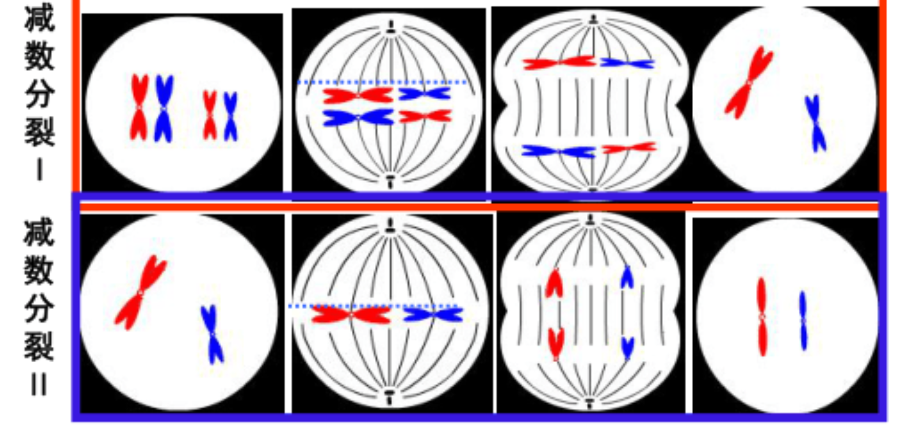
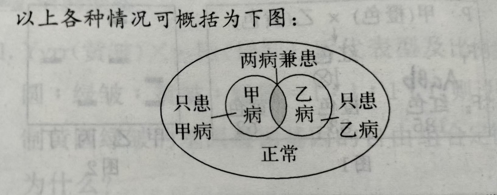

---
# biology(生物学)
## 分子生物学
- 常量元素
  - O、C、H、N、Ca、P、K、S、Na、Cl、Mg 
- 微量元素
  - Fe、Zn、Cu、I、Mn、B、Cr、MO、Se、F
- ATP（腺苷三磷酸）
  - 腺苷是由核糖与腺嘌呤组成<失去两个磷酸基团就成为了腺嘌呤核糖核苷酸>
  - 有两个高能磷酸键<A-pi~ pi ~pi>
- 酶
  - 大多数酶是蛋白质，也有如核酶的是RNA-蛋白质复合体
  - 热变性（不可逆）
  - 盐析（可逆）
  - 酶的种类  
    - 蛋白酶
    - 乳糖酶
    - 淀粉酶
    - 果胶酶and纤维素酶可以制取原生质体但一定要洗涤不能用稀释
    - 核酶（由RNA与蛋白质构成）
  - 单一性
  - 高效性
  - 保存需在零下4~3°C
  - 有最适温度、最适PH
- 细胞组成物质：C 、H、O、N、P、S等
    -  $\frac{freewater}{boundwater}\downarrow$
       - 抗逆性（对抗恶劣环境）增强 反之减弱
       代谢强度减弱   
  - 脂质
    - 磷脂（C、O、N、P）有疏水基---RcooR'、亲水基--磷酸
  - 蛋白质
    - 蛋白质相对分子质量计算：$氨基酸数目 \times 氨基酸平均分子质量-失去的水分子 \times 18=蛋白质相对分子质量$ 
    - 肽键计算：$失去水分子数=肽键数=氨基酸数-肽键数
  - 无机盐
  - 膳食纤维
    - 促进消化
    - 由纤维素组成（多糖）
  - 糖类
    - 糖原
      - 肝糖原<可分解为葡萄糖被机体所用>
      - 肌糖原<分解只给肌肉纤维所用>
    - 单糖
      - 葡萄糖<还原性>
      - 果糖<还原性>
      - 半乳糖<还原性>   
    - 双糖
      - $1mol葡萄糖+1mol半乳糖=1mol乳糖$
      - $2mol葡萄糖=1mol麦芽糖$
      - $1mol果糖+1mol葡萄糖=1mol蔗糖$
##  [x] 细胞学说
- virus
  - 无细胞结构
  - 只能依赖活细胞繁殖，离开活细胞的病毒一般不表现生命特征
- bacteria(原核生物)
  - 与真核生物共有的细胞器为核糖体 
- 施莱登与施旺是开创者
- cell 
  - 细胞膜
    - 脂伐模型、"三明治"模型、流动镶嵌模型
    - 物质跨膜运输  
    - 膜蛋白、通道蛋白<不对称性>、糖脂、糖蛋白
       磷脂双分子层（膜的流动性<结构特点>与选择透过性<功能特点>）
  - 细胞质
    - 细胞溶胶
      - 糖酵解的场所  
    - 细胞器
      - （内质网<分光面和粗面>、高尔基体、液泡、细胞骨架）核糖体<原核真核都有>
      - 线粒体
      - 叶绿体
      - "内共生假说"(真核生物来自与原核生物)
          - 叶绿体是真核生物祖先（植物）吞噬了类似蓝藻的原核生物
          - 线粒体是真核生物祖先吞噬了具有有氧呼吸相关酶的原核生物
  - 细胞核
    - 核仁、染色质、核基质 
     - 核膜 核孔(核膜内外两层之间的环形开口)
  - 细胞壁
    - 全透性 、保护细胞、维持细胞形态、加强细胞的机械强度
    - 由果胶与纤维素组成
    - 胞间连丝(激素和化学信号的传递介质和通路)
  - 细胞衰老
    - 细胞膜流动性降低
    - 色素积累、空包形成
    - 酶活性降低
    - 线粒体数量降低，体积变大，呼吸变慢
  - 衰老机制
    - "自由基"
    - 端粒
  - 细胞癌变
    - 原癌基因过度表达，抑癌基因被抑制
    - 癌细胞没有有氧呼吸即使在有氧环境也只进行厌氧呼吸
    - 无接触抑制，不贴壁生长
### 细胞重要的生化反应
- 呼吸作用
- 光合作用
  - CAM植物(景天科植物:芦荟、百合、仙人掌)=C4植物
    - 机制:夜间吸进CO2淀粉经糖酵解形成PEP(磷酸烯醇式丙酮酸)
    - 特性:对水的利用率高  
## 生理活动
### 体液调节
- 反馈调节
- 分级调节
### 神经调节
- 植物型神经(内脏神经)
  - 交感神经
  - 副交感神经
- 神经纤维与一条神经的特性区别
  - 结构组成：神经纤维由神经元的轴突或长树突以及包绕在其外的髓鞘或神经膜构成；而一条神经是由许多神经纤维集结成束，外包由结缔组织形成的膜构成
  - 功能特性：神经纤维主要功能是传导神经冲动，将信息以电信号的形式快速传递；一条神经的功能则更为复杂，不仅能传导神经冲动，还能进行信息的分析和处理，参与神经系统的各种调节活动  
- 动作电位的产生过程 
1.极化状态(內正外负)
2.去极化状态(内负外正)
3.复极化状态(膜内电位下降)
4.超极化————>极化状态 
- 完整的反射弧(不能缺少一个阶段)
  - 感受器
  - 传入神经
  - 神经中枢
  - 传出神经
  - 效应器 
## 具体操做
### 显微操作(制片)
1. 取镜
2. 安放 
3. 对光
4. 压片
5. 调焦
6. 观察
### 细胞工程
- PCR
  - DNA的复制亲代DNA双链均被15N标记
- 出现
- 植物组织培养
- 细胞融合(人鼠细胞杂交)
  - 确定某个基因在那条染色体上
- 肺炎链球菌活体转化(格里菲斯)
- 肺炎链球菌离体转化(艾弗里)  
- S型——有荚膜 R型——无荚膜
### 胚胎工程
## 生态学
 - 种群密度
   - 出生率
   - 死亡率
   - 迁入率
   - 迁出率
   - $自然增长率=出生率-死亡率$
   - $机械增长率=迁入率-迁出率$
   - $N=M\times\frac{n}{m}$ （N=动物总个体数，M=总数中被标记的个体数n=重捕个体数，m=重捕中被标志的个体数） 
  - 群落
    - 丰富度
    - 生态位
      - 生态位重叠后分化 
      - 生态位不可能完全重叠
    - 优势种(不可替代)
    - 生物之间能量传递效率=林德曼传递效率:$\frac{n+1个营养级的同化量}{n个营养级的同化量}$      
## 遗传学
- 减数分裂
  -    
- 有丝分裂
  - 生物学意义：保持亲子代的遗传性状稳定 
  - 秋水仙素抑制纺锤丝形成
  - 分裂末期植物细胞与动物细胞的区别：
    - 植物细胞会产生细胞板
    - 动物细胞会向内形成
-  |序号|类型|公式|
 |已知：患甲病的概率为m，患乙病的概率为n|
 - 
 - 
